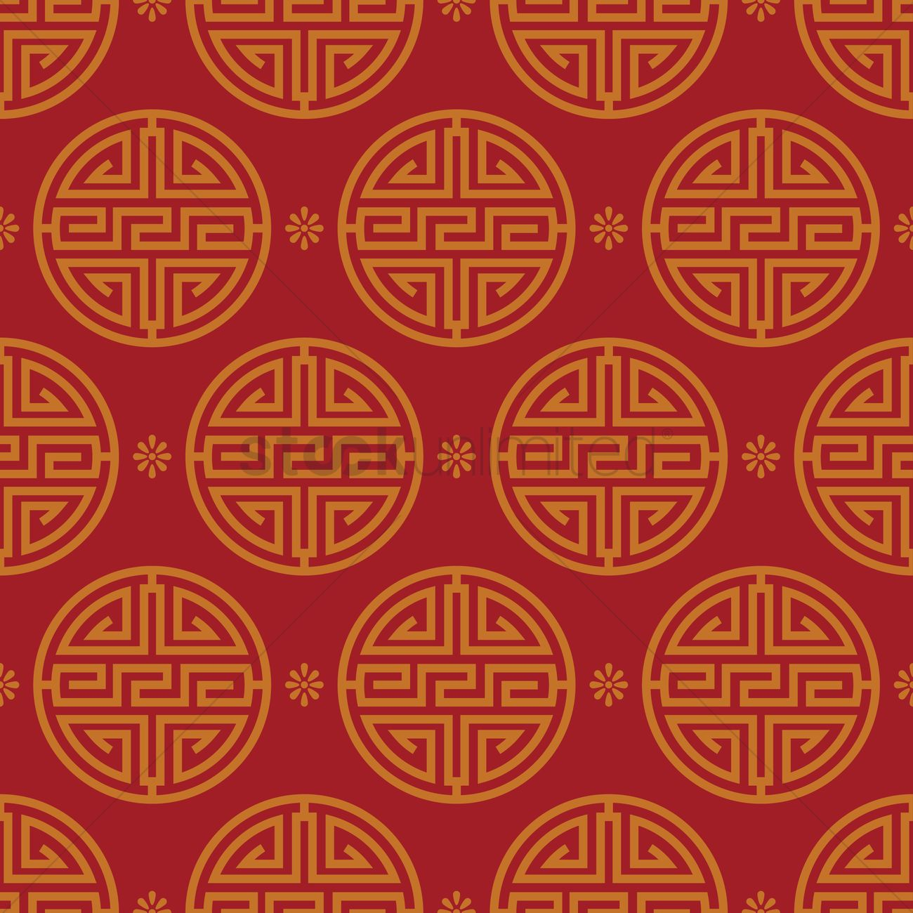

# Vulkan Tutorial (C++ Ver.)

## 图像

### 介绍

目前几何图形都是使用逐顶点颜色着色的，这是一种相当有限的方法。这一部分将实现纹理映射，使几何图形看起来更有趣。这也将允许我们在未来的章节中加载和绘制基本的 3D 模型。

添加纹理对象包括以下几步：
+ 创建一个由设备内存支持的映像对象
+ 从图片文件填充像素
+ 创建图像采样器
+ 添加组合图像采样器描述符从纹理对象中采样颜色

之前已经使用过图像对象，但它们是由交换链扩展自动创建的。这次我们必须自己创建一个。创建图像并填充数据与创建顶点缓冲区类似。我们将首先创建一个临时资源，并填充像素数据，然后我们将其复制到我们将用于渲染的最终图像对象。虽然可以为此目的创建一个临时资源，但 Vulkan 也允许将像素从 `vk::Buffer` 复制到图像中，并且在某些硬件上，这样做的 API 实际上更快。我们将首先创建这个缓冲区并用像素值填充，然后创建一个图像来复制像素。创建图像与创建缓冲区没有太大的不同。它包括查询内存需求、分配设备内存和绑定。

然而，在处理图像时，还有一些额外的事情必须注意。图像可以有不同的布局，从而影响像素在内存中的组织方式。例如，由于图形硬件的工作方式，简单地逐行存储像素可能无法获得最佳性能。在对图像执行任何操作时，必须确保它们具有适合该操作使用的最佳布局。当我们指定渲染通道时，我们实际上已经看到了其中的一些布局：
+ `vk::ImageLayout::ePresentSrcKHR`：作为呈现最优
+ `vk::ImageLayout::eColorAttachmentOptimal`：作为从片元着色器写入颜色的着色器最优
+ `vk::ImageLayout::eTransferSrcOptimal`：作为传输操作的源头最优，类似 `vkCmdCopyImageToBuffer`（还没有调用到）
+ `vk::ImageLayout::eTransferDstOptimal`：作为传输操作的目标最优，类似 `vkCmdCopyBufferToImage`
+ `vk::ImageLayout::eReadOnlyOptimal`：作为从着色器中采样最优

转换图像布局的最常用方法之一是管道屏障。管道屏障主要用于同步对资源的访问，例如确保在读取图像之前对其进行写入，但它们也可用于转换布局。在本章中，我们将看到管道屏障是如何用于此目的的。当使用 `vk::SharingMode::eExclusive` 时，屏障还可以用于转移队列族所有权。

### 图像库

有许多库可用于加载图像，您甚至可以编写自己的代码来加载 BMP 和 PPM 等简单格式。在本教程中，我们将使用 stb 集合中的stb_image 库。它的优点是所有的代码都在一个文件中，所以它不需要任何复杂的构建配置。下载 stb_image.h 并将其存储在一个方便的位置，就像保存 GLFW 和 GLM 的目录一样。将位置添加到包含路径中。

### 加载图像

```cpp
#define STB_IMAGE_IMPLEMENTATION
#include <utils/stb_image.h>
```

头文件默认只定义函数的原型。一个代码文件需要包含带有 `STB_IMAGE_IMPLEMENTATION` 定义的头文件，以包含函数体，否则我们将得到链接错误。

```cpp
void HelloTriangleApplication::initVulkan() {
    ...
    createCommandPool();
    createTextureImage();
    createVertexBuffer();
    ...
}

void HelloTriangleApplication::createTextureImage() {}
```

创建一个新函数 `createTextureImage`，我们将在其中加载图像并将其上传到 Vulkan 图像对象中。我们将使用命令缓冲区，所以它应该在 `createCommandPool` 之后调用。

在 `shaders` 目录旁边创建一个新目录 `textures` 来存储纹理图像。我们将从那个目录中加载一个名为 `texture.jpg` 的图像。该库支持最常见的图像文件格式，如 JPEG, PNG, BMP 和 GIF。



加载图片：
```cpp

void HelloTriangleApplication::createTextureImage()
{
    int texWidth, texHeight, texChannels;
    stbi_uc* pixels = stbi_load("./src/texture/redPattern.jpg", &texWidth, &texHeight, &texChannels, STBI_rgb_alpha);
    vk::DeviceSize imageSize = texWidth * texHeight * 4;

    if (!pixels)
        throw std::runtime_error("failed to load texture image!");
}
```

`stbi_load` 函数接受文件路径和要加载的通道数作为参数。`STBI_rgb_alpha` 值强制图像加载 `alpha` 通道，即使它没有 `alpha` 通道，这对于将来与其他纹理的一致性很好。中间的三个参数是图像中通道的宽度、高度和实际数量的输出。返回的指针是像素值数组中的第一个元素。在 `STBI_rgb_alpha` 的情况下，像素逐行布局，每个像素 4 字节，总共有 `texWidth`*`texHeight`*4 个值。

### 暂存缓冲区

现在我们将在主机可见内存中创建一个缓冲区，以便我们可以使用`mapMemory` 并将像素复制到它。将临时缓冲区的变量添加到 `createTextureImage` 函数中：
```cpp
vk::Buffer stagingBuffer;
vk::DeviceMemory stagingBufferMemory;
```

缓冲区应该在主机可见内存中，以便我们可以映射它，它应该可用作传输源头，以便我们稍后可以将其复制到映像中：
```cpp
createBuffer(imageSize, vk::BufferUsageFlagBits::eTransferSrc,
    vk::MemoryPropertyFlagBits::eHostVisible |
    vk::MemoryPropertyFlagBits::eHostCoherent,
    stagingBuffer, stagingBufferMemory);
```

然后我们可以直接将从图像加载库中获得的像素值复制到缓冲区中：

```cpp
void* data;
const auto&_ = m_Device.mapMemory(stagingBufferMemory, 0, imageSize, vk::MemoryMapFlags{0}, &data);
memcpy(data, pixels, imageSize);
m_Device.unmapMemory(stagingBufferMemory);
```

最后释放原有图像数组：
```cpp
stbi_image_free(pixels);
```

### 纹理图像

虽然我们可以设置着色器来访问缓冲区中的像素值，但为了达到这个目的，最好使用 Vulkan 中的图像对象。例如，图像对象允许我们使用 2D 坐标，从而使检索颜色变得更容易、更快。图像对象中的像素被称为纹素（texels），我们将从这里开始使用该名称。添加以下新的类成员：
```cpp
vk::Image m_TextureImage;
vk::DeviceMemory m_TextureImageMemory;
```

图像的参数在 `vk::ImageCreateInfo` 结构体中指定：
```cpp
vk::ImageCreateInfo imageInfo{};
imageInfo.setImageType(vk::ImageType::e2D)
    .setExtent(vk::Extent3D(texWidth, texHeight, 1))
    .setMipLevels(1)
    .setArrayLayers(1);
```

在 `setImageType` 中指定的图像类型告诉 Vulkan 图像中的纹素将使用哪种坐标系进行寻址。它可以创建 1D，2D 和 3D 图像。例如，一维图像可用于存储一组数据或梯度，二维图像主要用于存储纹理，三维图像可用于存储体素体积。范围字段指定图像的尺寸，基本上是每个轴上有多少个像素。这就是为什么深度必须是 1 而不是 0。我们的纹理不会是一个数组，我们现在不会使用`mipmapping`。

```cpp
imageInfo.setFormat(vk::Format::eR8G8B8A8Srgb);
```

Vulkan 支持许多可能的图像格式，但是我们应该对纹素使用与缓冲区中的像素相同的格式，否则复制操作将失败。

```cpp
imageInfo.setTiling(vk::ImageTiling::eOptimal);
```

`setTiling` 可以指定两个值（新 API 是三个）：
+ `vk::ImageTiling::eLinear`：纹素以行主顺序布局，雷系像素数组
+ `vk::ImageTiling::eOptimal`：为了实现最佳访问，纹素按照定义的顺序排列

与图像的布局不同，平铺模式不能在以后更改。如果您希望能够直接访问图像内存中的纹素，那么您必须使用 `vk::ImageTiling::eLinear`。我们将使用暂存缓冲区而不是暂存映像，所以这不是必需的。我们将使用 
`vk::ImageTiling::eOptimal` 从着色器有效访问。

```cpp
imageInfo.setInitialLayout(vk::ImageLayout::eUndefined);
```

`setInitalLayout` 可指定两个值：
+ `vk::ImageLayout::eUndefined`：GPU 无法使用，并且第一次转换将丢弃纹素
+ `vk::ImageLayout::ePreinitialized`：GPU 无法使用，但第一次转换将保留纹素

在第一次转换期间，很少有必要保留纹素的情况。但是，如果您希望将图像与 `vk::ImageTiling::eLinear` 布局结合使用，则可以使用一个图像作为分段图像。在这种情况下，您希望将文本数据上传到它，然后在不丢失数据的情况下将图像转换为传输源。然而，在我们的例子中，我们首先要将图像转换为传输目的地，然后从缓冲区对象复制文本数据到它，所以我们不需要这个属性，可以安全地使用 `vk::ImageLayout::eUndefined`。

```cpp
imageInfo.setUsage(vk::ImageUsageFlagBits::eTransferDst | vk::ImageUsageFlagBits::eSampled);
```

`setUsage` 字段与缓冲区创建时的字段具有相同的语义。该映像将用作缓冲区副本的目的地，因此应该将其设置为传输目的地。我们还希望能够从着色器访问图像来为我们的网格上色，所以使用应该包括 `vk::ImageUsageFlagBits::eSampled`。

```cpp
imageInfo.setSharingMode(vk::SharingMode::eExclusive);
```

图像只被支持图像和图像操作的队列族使用。

```cpp
imageInfo.setSamples(vk::SampleCountFlagBits::e1)
    .setFlags(vk::ImageCreateFlags{0}); // Optional
```

`setSamples` 标志与多采样有关。这只与将用作附件的图像相关，所以坚持使用一个示例。与稀疏图像相关的图像有一些可选标志。稀疏图像是指只有特定区域实际上由内存支持的图像。例如，如果你在体素地形中使用 3D 纹理，那么你可以使用它来避免分配内存来存储大量的“空气”值。我们不会在本教程中使用它，所以将其保留为默认值 0。

```cpp
m_TextureImage = m_Device.createImage(imageInfo);
if (!m_TextureImage)    throw std::runtime_error("failed to create image!");
```

图像是使用 `createImage` 创建的，它没有任何特别值得注意的参数。可能是图形硬件不支持 `mat` 的 `vk::Format::eR8G8B8A8Srgb`。您应该有一个可接受的替代方案列表，并选择支持的最佳方案。但是，对这种特殊格式的支持非常广泛，因此我们将跳过这一步。不同的格式也需要恼人的转换。我们将在深度缓冲区章节中回到这个问题，在那里我们将实现这样一个系统。

```cpp
m_TextureImage = m_Device.createImage(imageInfo);
if (!m_TextureImage)    throw std::runtime_error("failed to create image!");

vk::MemoryRequirements memRequirements = m_Device.getImageMemoryRequirements(m_TextureImage);

vk::MemoryAllocateInfo allocInfo{};
allocInfo.setAllocationSize(memRequirements.size)
    .setMemoryTypeIndex(findMemoryType(memRequirements.memoryTypeBits, properties));

m_TextureImageMemory = m_Device.allocateMemory(allocInfo);
if (!m_TextureImageMemory)
    throw std::runtime_error("failed to allocate image memory!");

m_Device.bindImageMemory(m_TextureImage, m_TextureImageMemory, 0);
```

为图像分配内存的方式与为缓冲区分配内存的方式完全相同。使用 `getImageMemoryRequirements` 而不是 `getBufferMemoryRequirements`，使用`bindImageMemory` 而不是 `bindBufferMemory`。

这个函数已经变得相当大了，在后面的章节中需要创建更多的图像，所以我们应该将图像创建抽象为 `createImage` 函数，就像我们对缓冲区所做的那样。创建函数并将映像对象创建和内存分配移到该函数中：
```cpp
void HelloTriangleApplication::createImage(
    uint32_t width, uint32_t height, vk::Format format,
    vk::ImageTiling tiling, vk::ImageUsageFlags usage,
    vk::MemoryPropertyFlags properties, 
    vk::Image& image, vk::DeviceMemory& memory)
{
    vk::ImageCreateInfo imageInfo{};
    imageInfo.setImageType(vk::ImageType::e2D)
        .setExtent({ width, height, 1 })
        .setMipLevels(1)
        .setArrayLayers(1)
        .setFormat(format)
        .setTiling(tiling)
        .setInitialLayout(vk::ImageLayout::eUndefined)
        .setUsage(usage)
        .setSamples(vk::SampleCountFlagBits::e1)
        .setSharingMode(vk::SharingMode::eExclusive);

    image = m_Device.createImage(imageInfo);
    if (!image) throw std::runtime_error("failed to create image!");

    vk::MemoryRequirements memRequirements = m_Device.getImageMemoryRequirements(m_TextureImage);

    vk::MemoryAllocateInfo allocInfo{};
    allocInfo.setAllocationSize(memRequirements.size)
        .setMemoryTypeIndex(findMemoryType(memRequirements.size, vk::MemoryPropertyFlagBits::eDeviceLocal));

    memory = m_Device.allocateMemory(allocInfo);
    if (!memory) throw std::runtime_error("failed to allocate image memory!");

    m_Device.bindImageMemory(image, memory, 0);
}
```

已经设置了宽度、高度、格式、平铺模式、用法和内存属性参数，因为这些参数在我们将在本教程中创建的图像之间都会有所不同。

`createTextureImage` 函数可以化简为：
```cpp
void HelloTriangleApplication::createTextureImage()
{
    int texWidth, texHeight, texChannels;
    stbi_uc* pixels = stbi_load("./src/texture/redPattern.jpg", &texWidth, &texHeight, &texChannels, STBI_rgb_alpha);
    vk::DeviceSize imageSize = texWidth * texHeight * 4;

    if (!pixels)
        throw std::runtime_error("failed to load texture image!");

    vk::Buffer stagingBuffer;
    vk::DeviceMemory stagingBufferMemory;

    createBuffer(imageSize, vk::BufferUsageFlagBits::eTransferSrc,
        vk::MemoryPropertyFlagBits::eHostVisible |
        vk::MemoryPropertyFlagBits::eHostCoherent,
        stagingBuffer, stagingBufferMemory);

    void* data;
    const auto&_ = m_Device.mapMemory(stagingBufferMemory, 0, imageSize, vk::MemoryMapFlags{0}, &data);
    memcpy(data, pixels, imageSize);
    m_Device.unmapMemory(stagingBufferMemory);

    stbi_image_free(pixels);

    createImage(texWidth, texHeight, vk::Format::eR8G8B8A8Srgb, vk::ImageTiling::eOptimal,
        vk::ImageUsageFlagBits::eTransferDst |
        vk::ImageUsageFlagBits::eSampled,
        vk::MemoryPropertyFlagBits::eDeviceLocal,
        m_TextureImage, m_TextureImageMemory);
}
```

### 布局过渡

添加 `beginSingleTimeCommands` 函数，包括记录和执行命令缓冲区：
```cpp
vk::CommandBuffer HelloTriangleApplication::beginSingleTimeCommands()
{
    vk::CommandBufferAllocateInfo allocInfo{};
    allocInfo.setLevel(vk::CommandBufferLevel::ePrimary)
        .setCommandPool(m_CommandPool)
        .setCommandBufferCount(1);
    
    vk::CommandBuffer commandBuffer = m_Device.allocateCommandBuffers(allocInfo).front();

    vk::CommandBufferBeginInfo beginInfo{};
    beginInfo.setFlags(vk::CommandBufferUsageFlagBits::eOneTimeSubmit);

    commandBuffer.begin(beginInfo);

    return commandBuffer;
}

void HelloTriangleApplication::endSingleTimeCommands(vk::CommandBuffer commandBuffer)
{
    commandBuffer.end();

    vk::SubmitInfo submitInfo{};
    submitInfo.setCommandBuffers(commandBuffer);

    m_GraphicsQueue.submit(submitInfo, nullptr);
    m_GraphicsQueue.waitIdle();

    m_Device.freeCommandBuffers(m_CommandPool, commandBuffer);
}
```

这些函数的代码基于 `copyBuffer` 中的现有代码。现在你可以将这个函数简化为：
```cpp
void HelloTriangleApplication::copyBuffer(vk::Buffer srcBuffer, vk::Buffer dstBuffer, vk::DeviceSize size)
{
    vk::CommandBuffer commandBuffer = beginSingleTimeCommands();

    vk::BufferCopy copyRegin{};
    copyRegin.setSrcOffset(0)
        .setDstOffset(0)
        .setSize(size);

    commandBuffer.copyBuffer(srcBuffer, dstBuffer, copyRegin);

    endSingleTimeCommands(commandBuffer);
}
```

如果我们仍然在使用缓冲区，那么我们现在可以编写一个函数来记录并执行 `copyBufferToImage` 来完成这项工作，但是这个命令首先要求图像处于正确的布局中。创建一个新函数来处理布局过渡：
```cpp
void HelloTriangleApplication::transitionImageLayout(vk::Image image, vk::Format format,
    vk::ImageLayout oldLayout, vk::ImageLayout newLayout)
{
    vk::CommandBuffer commandBuffer = beginSingleTimeCommands();

    endSingleTimeCommands(commandBuffer);
}
```

执行布局转换最常见的方法之一是使用图像内存屏障。像这样的管道屏障通常用于同步对资源的访问，例如确保对缓冲区的写入在读取之前完成，但是当使用 `vk::SharingMode::eExclusive` 时，它也可以用于转换图像布局和传输队列族所有权。有一个等效的缓冲区内存屏障来为缓冲区做这件事。
```cpp
vk::ImageMemoryBarrier barrier{};
barrier.setOldLayout(oldLayout)
    .setNewLayout(newLayout);
```

如果不关心现存的图像内容，则可以在 `setOldLayout` 指定 `vk::ImageLayout::eUndefined`。
```cpp
barrier.setSrcQueueFamilyIndex(VK_QUEUE_FAMILY_IGNORED)
    .setDstQueueFamilyIndex(VK_QUEUE_FAMILY_IGNORED);
```

如果您使用屏障来转移队列族所有权，那么这两个字段应该是队列族的索引。如果您不想这样做，它们必须设置为`VK_QUEUE_FAMILY_IGNORED` （不是默认值!）。
```cpp
barrier.setImage(image)
    .setSubresourceRange(vk::ImageSubresourceRange(
    vk::ImageAspectFlagBits::eColor,
    0,
    1,
    0,
    1));
```

`setImage` 和 `setSubresourceRange` 指定受影响的映像和映像的特定部分。我们的图像不是一个数组，也没有 mipmapping 级别，所以只指定了一个级别和图层。
```cpp
barrier.setSrcAccessMask(vk::AccessFlags{0})    // TODO
    .setDstAccessMask(vk::AccessFlags{0});  // TODO
```

`barrier` 主要用于同步目的，因此您必须指定涉及资源的哪些类型的操作必须在 barrier 之前发生，以及涉及资源的哪些操作必须在 barrier 上等待。我们需要这样做，尽管已经使用 `waitIdle` 手动同步。正确的值取决于旧的和新的布局，所以一旦我们弄清楚我们要使用哪个过渡，我们会回来完善这个函数。

```cpp
commandBuffer.pipelineBarrier(
    vk::PipelineStageFlags{0}, // TODO
    vk::PipelineStageFlags{0}, // TODO
    vk::DependencyFlags{0},
    nullptr, nullptr, barrier);
```

所有类型的管道屏障都用相同的函数提交。命令缓冲区后的第一个参数指定应该在屏障之前发生的操作发生在哪个管道阶段。第二个参数指定操作将等待屏障的管道阶段。允许在屏障之前和之后指定的管道阶段取决于在屏障之前和之后如何使用资源。允许的数值列在规格表中。例如，如果你打算在屏障之后从制服中读取数据，你可以指定 `vk::AccessFlagBits::eUniformRead` 的使用，以及最早将从制服中读取数据的着色器，例如 `vk::PipelineStageFlagBits::eVertexShader`。为这种类型的使用指定非着色器管道阶段是没有意义的，当你指定的管道阶段与使用类型不匹配时，验证层会发出警告。

第三个参数为 0 或 `vk::DependencyFlagBits::eByRegion`。后者将 barrier 转换为每个区域的条件。例如，这意味着允许实现已经开始读取到目前为止写入的资源部分。

最后三个参数引用三种可用类型的管道屏障数组：内存屏障、缓冲区内存屏障和映像内存屏障，就像我们在这里使用的那样。请注意，我们还没有使用 `vk::Format` 参数，但我们将在深度缓冲章节中使用它来进行特殊的过渡。

### 复制缓冲区到图像

回到 `createTextureImage` 之前增加函数  `copyBufferToImage`：
```cpp
void HelloTriangleApplication::copyBufferToImage(vk::Buffer buffer, vk::Image image, uint32_t width, uint32_t height)
{
    vk::CommandBuffer commandBuffer = beginSingleTimeCommands();

    endSingleTimeCommands(commandBuffer);
}
```

就像使用缓冲区复制一样，您需要指定将缓冲区的哪个部分复制到图像的哪个部分。这是通过VkBufferImageCopy结构体实现的：
```cpp
vk::BufferImageCopy region{};
region.setBufferOffset(0)
    .setBufferRowLength(0)
    .setBufferImageHeight(0)
    .setImageSubresource(vk::ImageSubresourceLayers(
        vk::ImageAspectFlagBits::eColor,
        0, 0, 1))
    .setImageOffset(vk::Offset3D(0, 0, 0))
    .setImageExtent(vk::Extent3D(width, height, 1));
```

`setBufferOffset` 指定换缓冲区中像素值开始的字节偏移数。`setBufferRowLength` 和 `setBufferImageHeight` 指定图像在内存中的布局。

例如，您可以在图像的行之间使用一些填充字节。为两者指定为 0 表示像素只是像我们的例子中那样紧密地排列。`setImageSubresource`，`setImageOffset` 和 `setImageExtent` 字段表示我们想要将像素复制到图像的哪个部分。

使用 `vkCmdCopyBufferToImage` 函数将缓冲区复制到图像的操作排队：
```cpp
commandBuffer.copyBufferToImage(buffer, image, vk::ImageLayout::eTransferDstOptimal, region);
```

第四个参数指示图像当前使用的布局。我在这里假设图像已经转换到最适合复制像素的布局。现在我们只将一个像素块复制到整个图像，但是可以指定一个 `vk::BufferImageCopy` 数组，以便在一次操作中从该缓冲区执行许多不同的图像复制。

### 准备纹理图像

现在我们有了完成设置纹理图像所需的所有工具，所以我们要回到 `createTextureImage` 函数。我们做的最后一件事是创建纹理图像。下一步是将暂存缓冲区复制到纹理图像。这包括两个步骤：
+ 将图像传输到 `vk::ImageLayout::eTransferDstOptimal`
+ 执行缓冲区的图像复制操作

使用创建的函数：
```cpp
transitionImageLayout(m_TextureImage, vk::Format::eR8G8B8A8Srgb, vk::ImageLayout::eUndefined, vk::ImageLayout::eTransferDstOptimal);
copyBufferToImage(stagingBuffer, m_TextureImage, texWidth, texHeight);
```

图像是用 `vk::ImageLayout::eUndefined` 布局创建的，因此在过渡 `m_TextureImage` 时应该指定为旧布局。记住，我们可以这样做，因为在执行复制操作之前，我们不关心它的内容。

为了能够从着色器中的纹理图像开始采样，我们需要最后一个过渡来为着色器访问做准备：
```cpp
transitionImageLayout(m_TextureImage, vk::Format::eR8G8B8A8Srgb, vk::ImageLayout::eTransferDstOptimal, vk::ImageLayout::eShaderReadOnlyOptimal);
```

### 传输屏障掩码（Transition barrier mask）

如果你现在在启用验证层的情况下运行应用程序，那么你会看到它抱怨 `transitionImageLayout` 中的访问掩码和管线阶段无效。我们仍然需要根据过渡中的布局来设置这些。
```bash
[validation] Validation Error: [ VUID-vkCmdPipelineBarrier-srcStageMask-03937 ] Object 0: handle = 0x5555569432e0, type = VK_OBJECT_TYPE_COMMAND_BUFFER; | MessageID = 0x80883de8 | vkCmdPipelineBarrier(): .srcStageMask must not be 0 unless synchronization2 is enabled. The Vulkan spec states: If the synchronization2 feature is not enabled, pname:srcStageMask must not be 0 (https://vulkan.lunarg.com/doc/view/1.3.239.0/linux/1.3-extensions/vkspec.html#VUID-vkCmdPipelineBarrier-srcStageMask-03937)
```

有两种方法处理：
+ Undefined -> transfer destination：传输写入不需要等待
+ Transfer destination -> shader reading：着色器读取应该等待传输写入，特别是片元着色器，因为那是我们要使用纹理的地方

修改函数 `transitionImageLayout` 并在 `pipelineBarrier` 之前添加访问掩码和管线阶段来指定：
```cpp
vk::PipelineStageFlags sourceStage;
vk::PipelineStageFlags destinationStage;

if (oldLayout == vk::ImageLayout::eUndefined &&
    newLayout == vk::ImageLayout::eTransferDstOptimal) {
        barrier.setSrcAccessMask(vk::AccessFlags{0})
            .setDstAccessMask(vk::AccessFlagBits::eTransferWrite);

        sourceStage = vk::PipelineStageFlagBits::eTopOfPipe;
        destinationStage = vk::PipelineStageFlagBits::eTransfer;
    } else if (oldLayout == vk::ImageLayout::eTransferDstOptimal &&
                newLayout == vk::ImageLayout::eShaderReadOnlyOptimal) {
        barrier.setSrcAccessMask(vk::AccessFlagBits::eTransferWrite)
            .setDstAccessMask(vk::AccessFlagBits::eShaderRead);

        sourceStage = vk::PipelineStageFlagBits::eTransfer;
        destinationStage = vk::PipelineStageFlagBits::eFragmentShader;
    } else {
        throw std::invalid_argument("unsupported layout transition!");
    }

commandBuffer.pipelineBarrier(
    sourceStage, destinationStage,
    vk::DependencyFlags{0},
    nullptr, nullptr, barrier);
```

从上面的表中可以看到，传输写必须发生在管道传输阶段。因为写操作不需要等待任何东西，所以您可以为预屏障操作指定一个空的访问掩码和最早的管道阶段 `vk::PipelineStageFlagBits::eTopOfPipe`。应该注意的是，`vk::PipelineStageFlagBits::eTransfer` 不是图形和计算管线中的真实阶段。这更像是一个发生转移的伪阶段。有关更多信息和其他伪阶段示例，请参阅文档。

图像将在相同的管线阶段写入，随后由片岩着色器读取，这就是为什么我们在片元着色器管线阶段指定着色器读取访问。

如果我们将来需要做更多的转换，那么我们将扩展这个功能。应用程序现在应该可以成功运行，当然还没有任何视觉变化。

需要注意的一点是，命令缓冲区提交在开始时导致隐式 `vk::AccessFlagBits::eHostWrite` 同步。由于 `transitionImageLayout` 函数只使用一个命令执行命令缓冲区，因此如果在布局转换中需要 `vk::AccessFlagBits::eHostWrite` 依赖项，则可以使用此隐式同步并将 `srcAccessMask` 设置为 0。这取决于你是否想要明确它，但我个人不喜欢依赖这些类似 OpenGL 的“隐藏”操作。

实际上有一种特殊类型的图像布局支持所有操作，`vk::ImageLayout::eGeneral`。当然，它的问题在于，它不一定能为任何操作提供最佳性能。在某些特殊情况下需要使用它，例如将图像同时用作输入和输出，或者在图像离开预初始化布局后读取图像。

到目前为止，提交命令的所有辅助函数都被设置为通过等待队列空闲来同步执行。对于实际应用程序，建议将这些操作组合在一个命令缓冲区中，并异步执行它们，以获得更高的吞吐量，特别是 `createTextureImage`函数中的转换和复制。尝试通过创建一个 `setupCommandBuffer`（辅助函数将命令记录到其中）并添加一个 `flushSetupCommands` 来执行到目前为止已记录的命令来进行实验。最好在纹理映射工作后执行此操作，以检查纹理资源是否仍然正确设置。

### 清理

通过在最后清理暂存缓冲区及其内存来完成 `createTextureImage` 函数：
```cpp
transitionImageLayout(m_TextureImage, vk::Format::eR8G8B8A8Srgb, vk::ImageLayout::eTransferDstOptimal, vk::ImageLayout::eShaderReadOnlyOptimal);

m_Device.destroyBuffer(stagingBuffer);
m_Device.freeMemory(stagingBufferMemory);
```

主纹理图像一直使用到程序结束：
```cpp
void HelloTriangleApplication::cleanUp() {
    cleanupSwapChain();

    m_Device.destroyImage(m_TextureImage);
    m_Device.freeMemory(m_TextureImageMemory);
    ...
}
```

现在图像包含了纹理，但是仍需要从图形管线访问它。